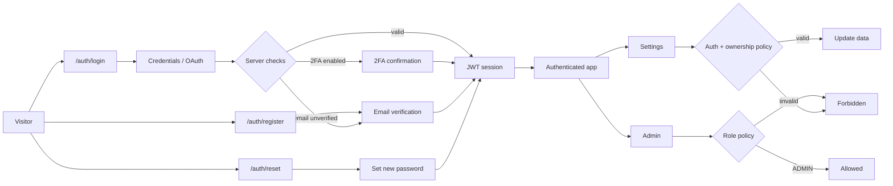
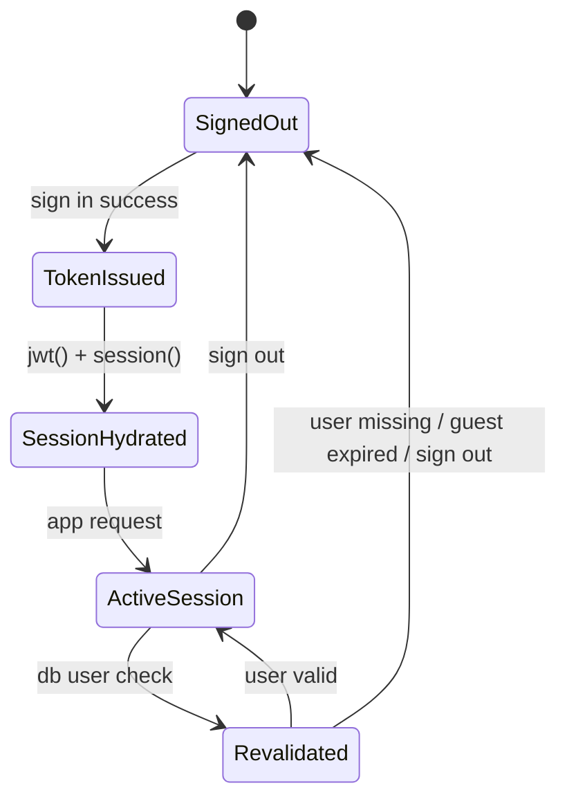

# Auth Diagrams

This file summarizes the core boundaries of the auth kit.

## 1) Auth Flow

## 2) Token Lifecycle

## 3) Role / Permission Matrix

| Area | ADMIN | USER | Guest |
| --- | --- | --- | --- |
| Login / register / reset | Yes | Yes | Yes |
| Email verification | Yes | Yes | Yes |
| 2FA | Yes | Yes | No |
| Settings update | Yes | Own account only | No |
| Admin route | Yes | No | No |

## Notes

- `ADMIN` / `USER` are Prisma roles.
- `Guest` is an account state, not a separate Prisma role.
- All real authorization decisions happen on the server.
